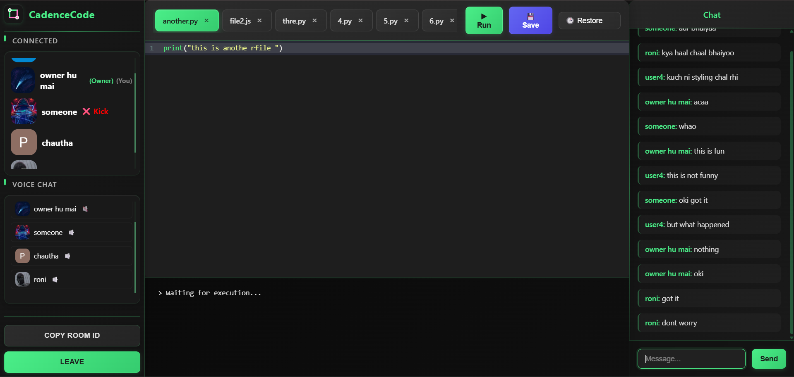

# CadenceCode: Real-Time Collaborative Code Editor

---

## 🚀 Overview

CadenceCode is a powerful, real-time collaborative code editor that allows developers to write, execute, and discuss code together in a shared environment. Whether you're pair programming, conducting technical interviews, or simply brainstorming with friends, CadenceCode provides a seamless and interactive experience with multi-language support, live chat, and robust collaboration features.

---

## ✨ Features

CadenceCode comes packed with features designed to enhance your collaborative coding experience:

* **Google Login:** Secure and convenient authentication using Google OAuth 2.0.
* **Dynamic Room System:** Easily create or join private coding rooms with unique IDs and optional password protection.
* **Real-Time Collaboration:** Experience instant code synchronization, allowing all users in a room to see changes as they happen.
* **Multi-File Support:** Organize your projects efficiently by adding, editing, and switching between multiple files within a single room.
* **Multi-Language Compatibility:** Write and run code in popular languages including **JavaScript, Python, C++,** and **Java**.
* **Cloud Code Execution:** Execute your code in the cloud via the **Judge0 API** and view the output instantly.
* **Checkpoints:** Never lose your work! Save and restore code checkpoints for individual files.
* **Integrated In-Room Chat:** Communicate effortlessly with your collaborators through the built-in chat panel.
* **User Management:** Room owners have the ability to kick disruptive users, maintaining a productive environment.
* **Responsive & Modern UI:** Enjoy a sleek, dark-themed, and mobile-friendly interface for a comfortable coding experience on any device.

---

## 💻 Technologies Used

CadenceCode is built using a modern and robust tech stack:

### Frontend

* **React:** A powerful JavaScript library for building interactive user interfaces.
* **React Router:** For declarative routing within the application.
* **React Hot Toast:** Elegant and responsive notifications.
* **CodeMirror:** A versatile in-browser code editor with autoCompletion.
* **@react-oauth/google:** Seamless Google OAuth integration for React applications.
* **Avatar:** For displaying user avatars.
* **CSS Modules:** For scoped and modular styling.

### Backend

* **Node.js:** A JavaScript runtime for building scalable server-side applications.
* **Express.js:** A fast, unopinionated, minimalist web framework for Node.js.
* **MongoDB:** A NoSQL database for flexible data storage.
* **Mongoose:** An elegant MongoDB object modeling for Node.js.
* **JWT (JSON Web Tokens):** For secure authentication and authorization.
* **Google Auth Library:** For interacting with Google APIs.
* **Judge0 API:** A robust and scalable online judge system for code execution.
* **Socket.IO:** For real-time, bidirectional communication.

### Real-Time Communication

* **WebSockets (Socket.IO):** Enables live code synchronization and in-room chat.

### Authentication

* **Google OAuth 2.0:** Secure and industry-standard authentication protocol.

### Other

* **REST API:** For efficient client-server communication.
* **CORS:** To handle cross-origin resource sharing.
* **Environment Variables:** For secure configuration management.

---

## 📸 Screenshots

### 1. Login Page


### 2. Room Entry


### 3. Main Editor After Login



---

## 📦 Getting Started

Follow these steps to get CadenceCode up and running on your local machine.

### Prerequisites

* Node.js (LTS version recommended)
* npm (Node Package Manager)
* MongoDB (local instance or cloud-hosted)
* A Google Cloud Project with OAuth 2.0 Client ID configured.
* A RapidAPI account to obtain a Judge0 API Key.

### Installation

1.  **Clone the repository:**
    ```bash
    git clone [https://github.com/i-amprince/CadenceCode.git](https://github.com/i-amprince/CadenceCode.git)
    ```

2.  **Navigate to the project directory:**
    ```bash
    cd CadenceCode
    ```

### Backend Setup

1.  **Navigate to the `Server` directory:**
    ```bash
    cd Server
    ```

2.  **Install backend dependencies:**
    ```bash
    npm install
    ```

3.  **Create a `.env` file:**
    Create a file named `.env` in the `Server` folder and populate it with your environment variables. You can refer to `.env.example` for the structure.

    ```
    PORT=5000
    MONGO_URI=mongodb://localhost:27017/collab-editor
    CLIENT_URL=http://localhost:3000

    JUDGE0_API_KEY=your_judge0_api_key
    JUDGE0_API_HOST=judge0-ce.p.rapidapi.com

    GOOGLE_CLIENT_ID=your_google_client_id
    JWT_SECRET=your_super_strong_jwt_secret
    ```
    * Replace `your_judge0_api_key` with your actual Judge0 API Key from RapidAPI.
    * Replace `your_google_client_id` with your Google OAuth 2.0 Client ID.
    * Replace `your_super_strong_jwt_secret` with a strong, random secret key for JWT.

4.  **Start the backend server:**
    ```bash
    npm start
    ```
    The backend server will typically run on `http://localhost:5000`.

### Frontend Setup

1.  **Navigate back to the project root directory:**
    ```bash
    cd ../
    ```

2.  **Install frontend dependencies:**
    ```bash
    npm install
    ```

3.  **Create a `.env` file:**
    Create a file named `.env` in the root (frontend) folder and add your Google Client ID:

    ```
    REACT_APP_GOOGLE_CLIENT_ID=your_google_client_id
    ```
    * Replace `your_google_client_id` with the same Google OAuth 2.0 Client ID used in the backend.

4.  **Start the frontend development server:**
    ```bash
    npm start
    ```
    The application will open in your browser, typically at [http://localhost:3000](http://localhost:3000).

---

## 🤝 Contributing

Contributions are always welcome! If you have suggestions for improvements, new features, or bug fixes, please feel free to open an issue or submit a pull request.

---

## 📝 License

This project is licensed under the [MIT License](LICENSE).

---

> Built with ❤️ by [Prince](https://github.com/i-amprince)